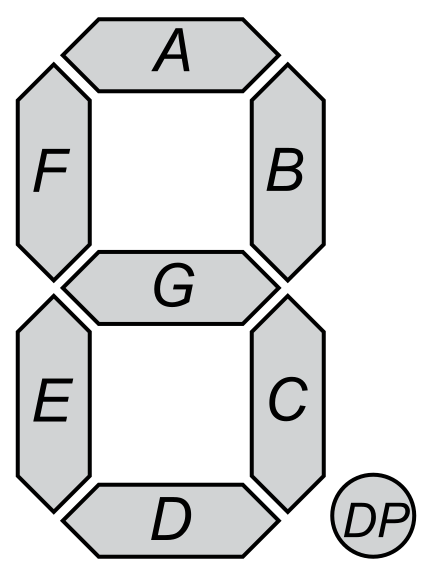
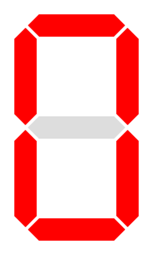
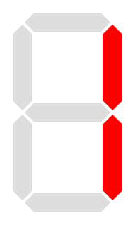
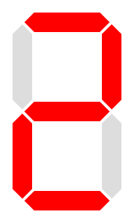
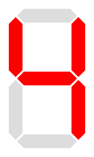
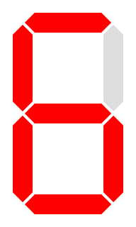
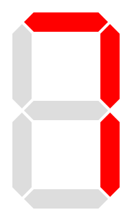
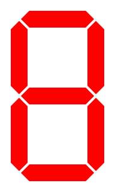
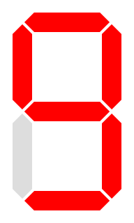
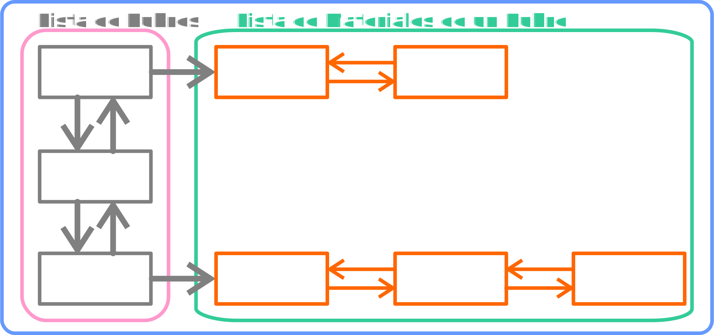

# Práctica 3: Listas

**En cada caso se debe implementar el TAD descripto y una aplicación que, utilizando el tipo abstracto de dato, permita
al usuario el ingreso de una o más instancias (según sea necesario), la aplicación de cualquiera de las operaciones y
luego la obtención del resultado.**

## Para empezar a trabajar

Construir el TAD de listas correspondientes a las implementaciones de “Arreglos”, “Punteros” y “Cursores” teniendo en cuenta:

-   Definir las estructuras de datos en función a las especificaciones dadas en clase y documentadas en los PDF que se encuentran en el aula virtual de la asignatura.
-   Se las debe implementar mediante objetos y respetar estrictamente los nombres y parámetros de cada una de las operaciones del TAD especificadas.
-   Se lo debe probar y testear de forma tal que se pueda asegurar que el TAD funciona correctamente.

**Aclaración:**

Los siguientes ejercicios siguientes deben ser implementados y resueltos en forma genérica, esto significa que se debería poder referenciar cualquiera de las implementaciones de lista (arreglo, puntero o cursor) y los mismos deben seguir en funcionamiento sin problemas.

## Ejercicios de Práctica opcionales

### Ejercicio 1

Dada una lista, realizar los siguientes ejercicios:

- Mostrar una lista desde el último elemento al primero.
- Calcular el menor de los datos e indique la posición ordinal.
- Calcular el dato máximo y cuente la cantidad de veces que se repita.
- Obtener el promedio de los datos de una lista. 
- Retornar otra lista con los números múltiplos de otro número que recibe como parámetro.
- Generar un algoritmo que genere números al azar únicos dentro de la lista.
- Retornar una lista reflejada o espejada. La función recibirá un parámetro adicional según el cual se repetirá o no el último elemento de la lista original. **Ejemplo:** Dada _L<sub>1</sub>_ = (A, B, C) ReflejarLista(_L<sub>1</sub>_, False) resultará igual a (A, B, C, B, A); mientras que ReflejarLista(_L<sub>1</sub>_, True) retornará (A, B, C, C, B, A).

_**Nota:** Implementar todas las funcionalidades de forma iterativa y de forma recursiva para poder analizar la diferencia en la complejidad algorítmica en cada caso._

### Ejercicio 2

Dadas 2 listas (_L<sub>1</sub>_ y _L<sub>2</sub>_) determinar si L2 es múltiplo de L1. Se considera múltiplo si cada elemento _L<sub>2</sub>_ se divide en forma exacta por el valor _L<sub>1</sub>_ de la misma posición.

> **Por Ejemplo:** si _L<sub>1</sub> = (2, 5, 7, 3)_ y _L<sub>2</sub> = (8, 20, 28, 12)_ entonces _L<sub>2</sub>_ es divisible por _L<sub>1</sub>_ porque cada posición de _L<sub>2</sub>_ se divide por el valor de _L<sub>1</sub>_ de la misma posición en forma exacta. Si el resultado de la división retorna el mismo valor para cada posición se dice que _L<sub>2</sub>_ es múltiplo de _L<sub>1</sub>_ por un **_escalar_**. Para este caso _4_ es el **_escalar_** de _L<sub>1</sub>_. **El algoritmo debe contemplar esta situación**.

### Ejercicio 3

Dadas dos listas _L<sub>1</sub>_ y _L<sub>2</sub>_ se pide compararlas siempre en el sentido _L<sub>1</sub>_ -> _L<sub>2</sub>_. Por lo tanto puede suceder que: _L<sub>1</sub>_ > _L<sub>2</sub>_; _L<sub>1</sub>_ = _L<sub>2</sub>_ o _L<sub>1</sub>_ < _L<sub>2</sub>_. La forma de obtener la comparación es por la clave, posición a posición, donde si _L<sub>1</sub>_ tiene más cantidad de claves mayores que _L<sub>2</sub>_ se considera que _L<sub>1</sub>_ > _L<sub>2</sub>_, por el contrario se considera _L<sub>1</sub>_ < _L<sub>2</sub>_. Serán iguales si cada elemento de _L<sub>1</sub>_ está en _L<sub>2</sub>_ sin importar la posición, ni la cantidad de ocurrencias. Por otro lado todos los elementos de _L<sub>2</sub>_ también deben estar en _L<sub>1</sub>_, sin importar la posición, ni la cantidad de ocurrencias.

**Determinar la complejidad algorítmica de la solución empleada.**

### Ejercicio 4

Generar un algoritmo que determine si una lista es sublista de otra. Se considera que es una sublista si todos los valores de la segunda se encuentran dentro de la primera sin importar el orden o posición de cada elemento. Se pide además determinar la complejidad algorítmica de la solución.

> **Ejemplo:** si _L<sub>1</sub>_ contiene los elementos _(A, Z, B, D, H, K)_ y _L<sub>2</sub>_ contiene los elementos _(D, K, A)_ se dice que _L<sub>2</sub>_ es sublista de _L<sub>1</sub>_.

### Ejercicio 5

Implementar un algoritmo recursivo genérico que reciba una lista y la devuelva ordenada de manera decreciente utilizando burbujeo. El método se define de la siguiente manera:

```
PROCEDURE Burbujeo(var L: Lista; P, Q: PosicionLista);
```

Donde `P` es la posición del primer elemento de la lista y `Q` la del segundo.

### Ejercicio 6

Generar un TAD Polinomio que implemente internamente una lista enlazada los coeficientes de un polinomio y que provea las siguientes funcionalidades.

> **Ejemplo**: _P(x) = -x <sup>3</sup> + 2.x<sup>2</sup> - 4_
> La lista sería: `(-1, 2, 0, -4)`

#### Evaluarlo en un punto

Realizar una función que dada un cierto valor de _X_ nos devuelva el valor del polinomio para ese punto.
En el ejemplo:

> **Ejemplo**: _P(2) = -1.2<sup>3</sup> + 2.1<sup>2</sup> - 4 = 12_ 

#### Valores característicos

Agregar al TAD funciones que devuelvan el “grado del polinomio”, “el coeficiente principal” y la “ordenada al origen”.

> **Ejemplo**: Grado: _`3`_; CoeficientePrincipal: _`-2`_; OrdenadaAlOrigen: _`-4`_.

#### Evaluarlo en un rango

Dado un rango de valores de _X_ y un valor de intervalo _I_, retorne una lista con los valores de _Y_ o _P(x)_.

> **Ejemplo**: Se pide retornar los valores de _P(x)_ con _`-1 < x < 1`_ de a _`0,5`_. Es decir se deberían retornar los valores de _`P(-1)`_, _`P(-0,5)`_, _`P(0)`_, _`P(0,5)`_ y _`P(1)`_.

#### Operar 2 polinomios

Resolver la “suma”, “resta” y “multiplicación" de polinomios.

-   Determinar la complejidad algorítmica de la solución empleada.
-   ¿Existe una mejor forma de resolverlo de tal forma de reducir la complejidad algorítmica?

## Ejercicios para entregar

### Ejercicio 7

Generar una lista de lista que permita almacenar como clave la patente de un vehículo (campo clave) y como valores de la clave las multas que se le realizaron a dicho vehículo. Se debe guardar como datos de la multa el número de acta (campo clave), la fecha y el importe (como valores), estado (Pendiente, Abonada, Anulada).

Se pide:

-   Dado un vehículo determinar el total adeudado por multas, la multa más antigua y la más reciente (comparable por las fechas).
-   ¿Cuál es el vehículo con mayor cantidad de infracciones?
-   ¿Cuál es el vehículo que más deuda de infracciones tiene?
-   ¿Existe algún vehículo/s que no tenga deuda de infracciones?

### Ejercicio 8

Se necesita saber el puntaje que suma un pacman en su recorrido hasta llegar a terminar el nivel.

En su recorrido se puede encontrar con frutas con distinto puntaje y con el activador del bonus que duplica todos los
puntos de las cosas que coma durante 10 pasos y que habilita la posibilidad de comerse el fantasma. Si se _come el
fantasma_ sin el bonus activado: Pierde.

Escribir un algoritmo que permita calcular el puntaje dada una lista de objetos
que se come el pacman. Para el cálculo tener en cuenta el siguiente listado de objetos que se come el pacman: (puntito:
1, frutilla: 10, banana: 30, cerezas: 50, fantasma: 100).

#### Por ejemplo:

> (puntito, frutilla, puntito, puntito, banana, puntito, puntito, fantasma, puntito, puntito, cerezas, puntito) -> Perdiste.<br />

> (puntito, puntito, puntito, banana, puntito, puntito, bonus, puntito, puntito, fantasma, puntito, puntito, cerezas, puntito) -> 345.

### Ejercicio 9

Generar un TAD que permita administrar la agenda de un ejecutivo. Se tiene un listado de tiempo se pretende dedicar a
cada actividad: (almuerzo de negocios: 120; atender cliente: 10; atender cliente VIP: 30; reunión con gerente: 30; etc).

- Programar las funciones necesarias que permitan insertar actividades a la agenda, controlando que no se superpongan
  actividades, guardando solo qué actividad se agenda y el horario de comienzo. _Se pide que esta lista se mantenga
  ordenada por el horario_.

  Por ejemplo:
  > (reunion con gerente, 9:30; atender cliente VIP, 10:30; almuerzo de negocios, 12:0; atender cliente VIP, 16: 30;atender Cliente, 17:10).

- Agregar una funcion que permita saber qué está haciendo el ejecutivo dado un horario.

  Por ejemplo:
    > 12:45 -> almuerzo de negocios.<br />
      17:45 -> libre.

- Un índice que le interesa a los ejecutivos es el porcentaje de ocupación de su día. Agregar una función que calcule este índice.

### Ejercicio 10
Un visualizador de siete segmentos o seven-segment display (SSD) es un dispositivo electrónico que permite mostrar caracteres numéricos (e incluso muchas de las letras) valiéndose de siete (7) segmentos luminosos nominados a, b, c, d, e, f y g, como se aprecia en la primera figura. Además en la tabla de abajo se puede observar qué segmentos se encuentran encendidos y cuáles apagados para visualizar cada dígito.



Justamente de estas relaciones surge el código 7-segmentos que representa cada dígito decimal con una secuencia de siete bits correspondientes al estado encendido (1) o apagado (0) de los segmentos a a g. En la última columna de la tabla se tiene el valor de cada número según este código.

<table>
<tr>
<th>Digit to display</th>
<th>a</th>
<th>b</th>
<th>c</th>
<th>d</th>
<th>e</th>
<th>f</th>
<th>g</th>
<th>Cod 7-S</th>
</tr>
<tr>
  <th>0 &rarr; </th><td>ON</td><td>ON</td><td>ON</td><td>ON</td><td>ON</td><td>ON</td><td>OFF</td><td>1111110</td>
</tr>
<tr>
  <th>1 &rarr; </th><td>OFF</td><td>ON</td><td>ON</td><td>OFF</td><td>OFF</td><td>OFF</td><td>OFF</td><td>0110000</td>
</tr>
<tr>
  <th>2 &rarr; </th><td>ON</td><td>ON</td><td>OFF</td><td>ON</td><td>ON</td><td>OFF</td><td>ON</td><td>1101101</td>
</tr>
<tr>
  <th>3 &rarr; </th><td>ON</td><td>ON</td><td>ON</td><td>ON</td><td>OFF</td><td>OFF</td><td>ON</td><td>1111001</td>
</tr>
<tr>
  <th>4 &rarr; </th><td>OFF</td><td>ON</td><td>ON</td><td>OFF</td><td>OFF</td><td>ON</td><td>ON</td><td>0110011</td>
</tr>
<tr>
  <th>5 &rarr; </th><td>ON</td><td>OFF</td><td>ON</td><td>ON</td><td>OFF</td><td>ON</td><td>ON</td><td>1011011</td>
</tr>
<tr>
  <th>6 &rarr; </th><td>ON</td><td>OFF</td><td>ON</td><td>ON</td><td>ON</td><td>ON</td><td>ON</td><td>1011111</td>
</tr>
<tr>
  <th>7 &rarr; </th><td>ON</td><td>ON</td><td>ON</td><td>OFF</td><td>OFF</td><td>OFF</td><td>OFF</td><td>1110000</td>
</tr>
<tr>
  <th>8 &rarr; </th><td>ON</td><td>ON</td><td>ON</td><td>ON</td><td>ON</td><td>ON</td><td>ON</td><td>1111111</td>
</tr>
<tr>
  <th>9 &rarr; </th><td>ON</td><td>ON</td><td>ON</td><td>ON</td><td>OFF</td><td>ON</td><td>ON</td><td>1111011</td>
</tr>
</table>

Se pide implementar un TAD de esta codificación mediante listas de la siguiente manera: En una lista se podrán representar un número natural de n cifras; cada una de estas se almacenará en un elemento, codificada según 7-S.

#### Carga de un número
Al inicializar el TAD se permitirá el ingreso de dos valores que serán representados exclusivamente como se acaba de especificar.
> **Ejemplo:** Digital.cargar(142,35); generará internamente 2 listas _numero1 := (0110000, 0110011, 1101101)_ y _numero2 := (1111001, 1011011)_

#### Operaciones
Implementar la posibilidad de realizar las 4 operaciones básicas, siempre que sea posible en el campo de los números naturales. En el caso de la división se devolverá no sólo el cociente sino también el resto. Si bien se permite que las operaciones sean hechas en base diez, el resultado debe representarse de la misma manera que los operandos.
> **Ejemplo:** Digital.sumar(); retornará (0110000, 1110000, 1110000).
> Digital.restar(); retornará (0110000, 1111110, 1110000). Etc.

<!-- 
### Ejercicio 10
Generar una **lista de lista** que permita almacenar como clave el rubro del material (campo clave) y como valores de la clave las materiales que forman ese rubro.  Se debe guardar como datos del material código (campo clave), la descripción, el stock, el stock mínimo, la unidad de medida (como valores).  Para el rubro se debe guardar su código (clave) y descripción (valor). Las unidades de medida son: `UND`, `KG` y `MTS`.

Se pide:
-	Dado un rubro determinar los materiales que lo conforman.
-	¿Existen materiales agotados (0 stock)? ¿cuáles son?
-	¿Cuáles son los materiales cuyo stock está por debajo del mínimo?
-	¿Existe algún rubro que todos sus materiales están por debajo del stock mínimo?


-->