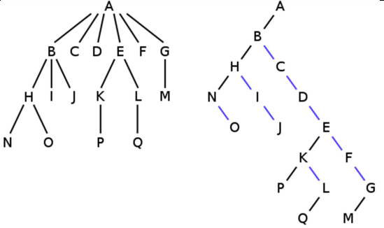

# Práctica 5: Árboles

**En cada caso se debe implementar el TAD descripto y una aplicación que,
utilizando el tipo abstracto de dato, permita al usuario el ingreso de una o más instancias (según sea necesario), la aplicación de cualquiera de las operaciones y luego la obtención del resultado.**

## Para empezar a trabajar

Construir el TAD de Arboles correspondiente a la implementación de “Punteros” teniendo en cuenta:

- Definir las estructuras de datos en función a las especificaciones dadas en clase y documentadas en los PDF que se encuentran en el aula virtual de la asignatura.
- Se las debe implementar respetando estrictamente los nombres y parámetros de cada una de las operaciones del TAD especificadas.
- Se lo debe probar y testear de forma tal que se pueda asegurar que el TAD funciona correctamente.

## Arboles Binarios

### Analizando los árboles binarios

Dado un `árbol binario` no vacío, se pide implementar funciones que retornen:

- Una lista con los nodos terminales u hojas.
- Una lista con todos los nodos interiores (los que no son ni hojas ni raíz)
- Un booleano que determine si todas las hojas están en el mismo nivel.
- Una lista con todas las posiciones de las ocurrencias de una clave dentro del arbol.

Determinar la complejidad algorítmica de las soluciónes.

### Conociendo los nodos

Para un `nodo` del árbol binario determinado, se pide implementar funciones que retornen:

- El nombre del nodo padre.
- Una lista con todos sus hijos.
- Una lista con su nodo hermano.
- El nivel en el que se encuentra.
- La altura de su rama (Altura del Subárbol).
- Una lista con todos los nodos que están en el mismo nivel.
- Un booleano que determine si es equivalente con otro arbol binario dado.

## Arboles N-arios

### Analizando los árboles

Un árbol n-ario puede ser representado como binario utilizando la **transformación de Knuth**. Esto puede ser útil para manejar árboles n-arios en estructuras de almacenamiento fijo, sin necesidad de conocer el "n" del árbol.

Se propone un árbol binario derivado del n-ario, tal que para cada nodo del árbol n-ario, su primer hijo es el hijo izquierdo en el árbol binario, y los hermanos de cada nodo son sus hijos derechos.

> Ejemplo: (n-ario a la izquierda, representado en binario a la derecha)

Dado un `árbol N-ario`, se pide implementar funciones que retornen:

- La altura del mismo.
- El nivel de un nodo.
- Una lista con todos las claves de los nodos internos.
- Un booleano que determine si todas las hojas están al mismo nivel.
- Una lista con el resultado del recorrido en anchura del árbol.
- La cantidad de hojas de dicho árbol.
- Un booleano, que dados dos árboles generales, determine si tienen la misma estructura, sin importar los datos del mismo (árbol similar).
- El padre de un nodo del árbol.
- Una lista con los hermanos de un nodo del árbol.

## Arboles Binarios de Búsqueda Balanceados (AVL)

### Insertar y Eliminar

- Mostrar el resultado de insertar `5`, `3`, `8`, `15`, `9`, `13`, `6`, `11`, `10` y `12` en un árbol.
  AVL inicialmente vacío (indicando las rotaciones realizadas).
- Dibujar el árbol AVL que resulta de realizar las siguientes inserciones: `7`, `11`, `10`, `2`, `22,` `8`, `4`, `21`, `13`. A continuación, eliminar los elementos: `8`, `4`, `7`.
- Realizar las operaciones que se detallan, marcando para cada nodo su factor de equilibrio en cada momento. En caso de producirse desequilibrio, indicar la causa y explicar con detalle qué operación se ha utilizado para resolverlo.
  - Inserciones: `15`, `11`, `12`, `9`, `19`, `10`, `14`, `16` y `25`.
  - Eliminaciones: `14`, `15` y `10`.

## Árboles `B` y `B+`

### ¿Cómo funcionan?

- Dibujar el árbol B de orden 5, resultado de insertar los siguientes datos: `3`, `6`, `13`, `2`, `5`, `8`, `4`, `19`, `15`, `9`, `21`, `11`.
- Dibujar el árbol B de orden 5 que resulta a partir de la siguiente entrada de datos: `A`, `D`, `M`, `P`, `Z`, `B`, `J`, `N`, `G`, `U`, `R`, `K`, `E`, `H`, `O`, `L`, `F`, `S`, `C`, `T`.
- Dibujar el árbol B de orden 5 que resulta de realizar las siguientes inserciones: `11`, `7`, `6`, `2`, `1`, `14`, `18`, `13`, `10`, `5`, `21`, `19`, `16`, `24`, `31`, `12`, `4`, `22` y `28`.
- A continuación, eliminar los elementos: `18`, `11` y `16`.

## Ejercicios de Implementación

### Arbol de Expresión

Escribir un algoritmo que determine si un `árbol binario` cargado puede ser un árbol de expresión.

> Ver en la bibliografía o PDF de la asignatura qué es un árbol de expresión. También pueden consultarse más detalles en el [siguiente enlace](https://miguelangelperezautomatas.blogspot.com/2019/09/arboles-de-expresiones.html).

Características de un árbol de expresión:

- La raíz siempre debe ser un operador.
- La raíz de todo subárbol siempre es un operador.
- Las hojas siempre deben ser operandos.
- Los nodos internos deben estar etiquetados por operadores.
- Si un operador tiene mayor prioridad que el que está almacenado en un nodo, se coloca como hijo del mismo.
- Si un operador tiene igual o menor prioridad que el que está en un nodo, se coloca como padre de éste.
- Una expresión entre paréntesis tiene mayor prioridad que cualquier otra.
- Un nodo puede contener como hijo un subárbol que contiene una pequeña expresión.- Los paréntesis no se representan porque no son necesarios.

### Comparando árboles

#### Binario vs. AVL

Generar un algoritmo, recursivo o no, que permita construir un árbol binario de búsqueda balanceado (AVL) a partir de un árbol binario sin un orden determinado.

Comparar las alturas de ambos árboles.

Determinar la complejidad algorítmica.

#### Binario de Búsqueda vs. AVL

Cargar la misma serie de números en un árbol binario de búsqueda y en un árbol binario balanceado “AVL”.

Comparar la altura de ambos árboles. Repetir el proceso `n` veces. ¿Qué puede concluir al respecto?

#### AVL vs. B vs. B+

Dada una serie de números generados al azar, cargarla en un árbol binario de búsqueda balanceado (AVL), en un Árbol “B” y “B+”. Comparar la altura de los árboles.

Repetir el proceso `n` veces. Se debe poder ingresar la cantidad de claves a generar al azar, la cantidad de repeticiones `n` que se desea ejecutar el proceso.

¿Qué puede concluir al respecto?

### Texto predictivo (LITE)

Se necesita armar un proceso que pueda ir almacenando palabras a medida que se van “tipeando”, cuando uno va escribiendo que trate de inferir de que palabra se trata.

Usar un árbol para resolver el problema (similar a los diccionarios de los celulares por ejemplo).

Se pide:

- Tener una opción para ver el diccionario que tiene.
- Retornar en orden descendente de la palabra más usada a la menos usada, con la cantidad de apariciones.
- Permitir escribir usando el diccionario, donde nos vaya dando las 5 palabras que podrían coincidir con lo que vamos escribiendo.
